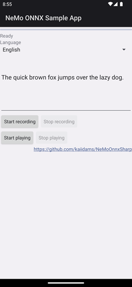

# NeMoOnnxAndroidApp

A sample application of using NeMoOnnxSharp with Xamarin Android.
This supports VAD (voice activation detection), speech recognition and speech synthesis.

## Requirement

- Visual Studio 2022
- .NET Android (Xamarin Android)
- API level 27 (Oreo) is required.

## Building

- Open the solution with Visual Studio 2022

## Running

English and German are supported.

The applicatin needs model files downloaded from GitHub.
Click "Download models" button to download them.
