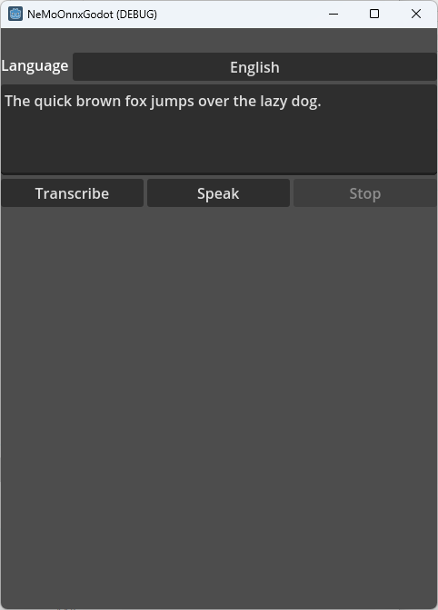

# NeMoOnnxGodot

A sample application of using NeMoOnnxSharp with Godot.
This supports VAD (voice activation detection), speech recognition and speech synthesis.

## Requirement

- Visual Studio 2022
- Godot 4.1.2
- Windows 11 (or versions for which Godot supports)

## Building

- Open the directory with Godot Editor
- Open the solution with Visual Studio 2022
- From menu Build -> Build Solution

Copy these native DLL files must be on the directory. You can
find them usually in `.godot\mono\temp\bin\Debug\runtimes\win-x64\native`.

- onnxruntime.dll
- onnxruntime_providers_shared.dll

Then run with debugger (F5) from Godot Editor
or export to Windows exe.

## Running

English and German are supported.

The applicatin needs model files downloaded from GitHub.
Click "Download models" button to download them.

Click Transcribe button to start VAD and speech recognition using a microphone.
Click Speak to generate audio from the text.
