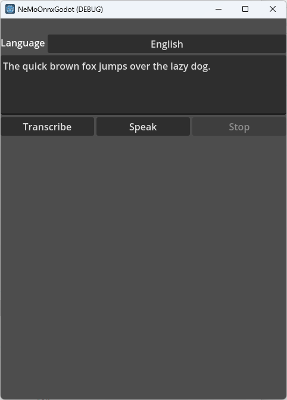
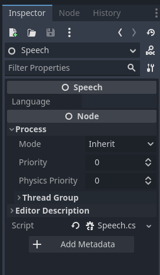

# NeMoOnnxGodot

A sample Godot project of using
[NeMoOnnxSharp](https://github.com/kaiidams/NeMoOnnxSharp).
This project supports VAD (voice activation detection), speech recognition and speech synthesis.
NeMoOnnxSharp is a inference library written in C# for [NVIDIA NeMo](https://github.com/NVIDIA/NeMo) with
[ONNX Runtime](https://github.com/microsoft/onnxruntime).



## Requirement

- Visual Studio 2022
- Godot 4.1.2
- Windows 11 (or versions for which Godot supports)

## Building

- Open the directory with Godot Editor
- Open the solution with Visual Studio 2022
- From menu Build -> Build Solution
- Then run with debugger (F5) from Godot Editor or export to Windows exe.

## Running

English and German are supported.

The applicatin needs model files downloaded from GitHub.
Click "Download models" button to download them.

Click Transcribe button to start VAD and speech recognition using a microphone.
Click Speak to generate audio from the text.

## Importing to your project

NeMoOnnxSharp needs ONNX Runtime NuGet package. Add these to your `.csproj` file.

```xml
  <ItemGroup>
    <PackageReference Include="Microsoft.ML.OnnxRuntime" Version="1.16.1" />
    <PackageReference Include="NeMoOnnxSharp" Version="1.3.0" />
  </ItemGroup>
```

`Script.cs` is the main script to use. Attach it to a Godot node in the inspector.


